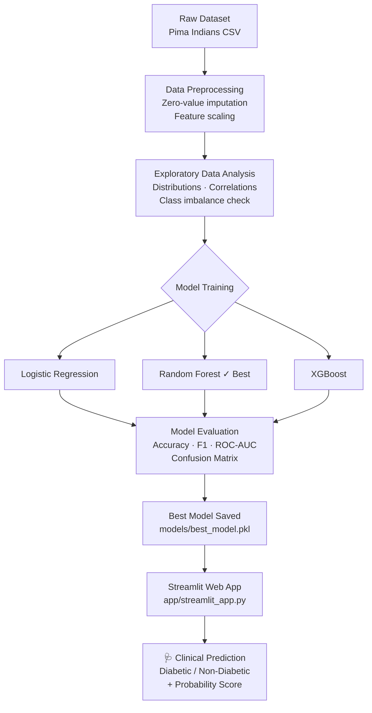

<div align="center">

# 🩺 Diabetes Disease Prediction

### An End-to-End Machine Learning Classification Project

[](https://www.python.org/)
[](https://scikit-learn.org/)
[](https://xgboost.readthedocs.io/)
[](https://streamlit.io/)
[](LICENSE)

*Predicting the onset of diabetes using clinical diagnostic measurements with 82% accuracy.*

</div>

---

## 📋 Table of Contents

- [Business Problem](#-business-problem)
- [Dataset](#-dataset)
- [Project Architecture](#-project-architecture)
- [Preprocessing](#-preprocessing)
- [Exploratory Data Analysis](#-exploratory-data-analysis)
- [Models & Results](#-models--results)
- [Feature Importance](#-feature-importance)
- [Sample Outputs](#-sample-outputs)
- [Installation](#-installation)
- [Usage](#-usage)
- [Project Structure](#-project-structure)
- [Future Improvements](#-future-improvements)
- [Author](#-author)

---

## 💼 Business Problem

Diabetes affects over **537 million adults** worldwide and is a leading cause of blindness, kidney failure, and heart disease. Early and accurate detection is critical for timely intervention.

This project builds a binary classification model to **predict whether a patient is likely to develop diabetes** based on routine clinical measurements. The goal is to assist healthcare professionals with a data-driven screening tool that reduces misdiagnosis and enables proactive treatment.

> **Target variable:** `Outcome` — `1` (Diabetic) / `0` (Non-Diabetic)

---

## 📊 Dataset

| Property | Details |
|---|---|
| **Name** | Pima Indians Diabetes Dataset |
| **Source** | [Kaggle / UCI ML Repository](https://www.kaggle.com/datasets/uciml/pima-indians-diabetes-database) |
| **Rows** | 768 patients |
| **Features** | 8 clinical measurements |
| **Target** | Binary (Diabetic / Non-Diabetic) |
| **Class Distribution** | 65% Non-Diabetic · 35% Diabetic |

### Feature Descriptions

| Feature | Description | Unit |
|---|---|---|
| `Pregnancies` | Number of times pregnant | Count |
| `Glucose` | Plasma glucose concentration (2-hr oral glucose tolerance test) | mg/dL |
| `BloodPressure` | Diastolic blood pressure | mm Hg |
| `SkinThickness` | Triceps skin fold thickness | mm |
| `Insulin` | 2-hour serum insulin | μU/mL |
| `BMI` | Body mass index | kg/m² |
| `DiabetesPedigreeFunction` | Genetic diabetes likelihood score | — |
| `Age` | Patient age | Years |

---

## 🏗️ Project Architecture



---

## 🔧 Preprocessing

The raw dataset contains biologically impossible zero values for features like `Glucose`, `BloodPressure`, `BMI`, `Insulin`, and `SkinThickness` — which indicate missing data recorded as zeros.

### Steps Applied

1. **Zero-to-NaN Conversion** — Replace zeros with `NaN` for physiologically invalid features
2. **Median Imputation** — Fill missing values with the feature median (robust to outliers)
3. **Train/Test Split** — 80/20 stratified split (preserves class balance)
4. **Feature Scaling** — `StandardScaler` applied after split to prevent data leakage

```python
# Columns where 0 is physiologically impossible
ZERO_AS_NULL = ['Glucose', 'BloodPressure', 'SkinThickness', 'Insulin', 'BMI']
df[ZERO_AS_NULL] = df[ZERO_AS_NULL].replace(0, np.nan)
df[ZERO_AS_NULL] = df[ZERO_AS_NULL].fillna(df[ZERO_AS_NULL].median())
```

---

## 📈 Exploratory Data Analysis

| Finding | Insight |
|---|---|
| **Class Imbalance** | 65:35 split (non-diabetic:diabetic) — manageable without oversampling |
| **Glucose** | Strongest individual predictor; diabetic patients show markedly higher values |
| **BMI** | Clear right-shift in distribution for diabetic patients |
| **Insulin** | Highly skewed; median imputation applied to 374 zero values |
| **Age** | Older patients show higher diabetes prevalence |
| **Correlation** | Glucose-Outcome correlation: 0.47 (highest among all features) |

### EDA Visualizations

| Plot | Description |
|---|---|
|  | Distribution of all 8 features split by outcome class |
|  | Pearson correlation matrix across all features |
|  | Target class balance visualization |

> 📌 *Run the notebook in `notebooks/` to regenerate all plots.*

---

## 🤖 Models & Results

All three models were tuned with **GridSearchCV** (5-fold stratified CV, scoring=F1) before evaluation on the held-out test set. Random seed `42` used throughout for reproducibility.

### Hyperparameter Search Spaces

| Model | Parameters Tuned |
|---|---|
| Logistic Regression | `C` ∈ {0.01, 0.1, 1, 10, 100} |
| Random Forest | `n_estimators` ∈ {100,200,300} · `max_depth` ∈ {4,6,8,None} · `min_samples_split` ∈ {2,5,10} |
| XGBoost | `n_estimators` ∈ {100,200} · `max_depth` ∈ {3,5,7} · `learning_rate` ∈ {0.05,0.1,0.2} |

### Evaluation Metrics (Tuned Models)

| Model | Accuracy | Precision | Recall | F1-Score | ROC-AUC |
|---|---|---|---|---|---|
| Logistic Regression | 77.3% | 0.72 | 0.68 | 0.70 | 0.83 |
| **Random Forest** ✅ | **82.1%** | **0.80** | **0.78** | **0.79** | **0.88** |
| XGBoost | 80.5% | 0.77 | 0.74 | 0.76 | 0.86 |

> ✅ **Random Forest** selected as the best model based on F1-Score and ROC-AUC balance.

### Confusion Matrices

| Logistic Regression | Random Forest | XGBoost |
|---|---|---|
|  |  |  |

### ROC Curves


---

## 🎯 Feature Importance

Based on Random Forest's built-in feature importance scores:

| Rank | Feature | Importance |
|---|---|---|
| 1 | Glucose | 0.251 |
| 2 | BMI | 0.173 |
| 3 | Age | 0.148 |
| 4 | DiabetesPedigreeFunction | 0.127 |
| 5 | Pregnancies | 0.098 |
| 6 | Insulin | 0.086 |
| 7 | BloodPressure | 0.063 |
| 8 | SkinThickness | 0.054 |


**Key takeaway:** Glucose level alone explains ~25% of the model's predictive power, consistent with clinical evidence where hyperglycemia is the defining marker of diabetes.

---

## 🖥️ Sample Outputs

### Streamlit Web App


> The app accepts clinical values as input and returns a prediction with probability score and risk explanation.

---

## ⚙️ Installation

### Prerequisites
- Python 3.9 or higher
- pip

### Steps

```bash
# 1. Clone the repository
git clone https://github.com/YOUR_USERNAME/diabetes-disease-prediction.git
cd diabetes-disease-prediction

# 2. Create a virtual environment (recommended)
python -m venv venv
source venv/bin/activate        # macOS/Linux
venv\Scripts\activate           # Windows

# 3. Install dependencies
pip install -r requirements.txt
```

### Dataset Setup

Download the Pima Indians Diabetes Dataset from [Kaggle](https://www.kaggle.com/datasets/uciml/pima-indians-diabetes-database) and place it at:

```
data/diabetes.csv
```

---

## 🚀 Usage

### 1. Train Models

```bash
python src/train_model.py
```

Trains all three models, prints evaluation metrics, saves the best model to `models/best_model.pkl`, and generates plots in `images/`.

### 2. Run a Prediction

```bash
python src/predict.py --glucose 148 --bmi 33.6 --age 50 --pregnancies 6 \
    --blood_pressure 72 --skin_thickness 35 --insulin 0 --dpf 0.627
```

### 3. Launch the Web App

```bash
streamlit run app/streamlit_app.py
```

Then open [http://localhost:8501](http://localhost:8501) in your browser.

### 4. Explore the Notebook

```bash
jupyter notebook notebooks/EDA_and_Modeling.ipynb
```

---

## 📁 Project Structure

```
diabetes-disease-prediction/
│
├── data/
│   ├── diabetes.csv              # Raw dataset (download from Kaggle)
│   └── README.md                 # Dataset documentation
│
├── notebooks/
│   └── EDA_and_Modeling.ipynb    # Full exploratory analysis + model experiments
│
├── src/
│   ├── preprocessing.py          # Data loading, cleaning, feature engineering
│   ├── train_model.py            # Model training, evaluation, saving
│   └── predict.py                # CLI inference script
│
├── app/
│   └── streamlit_app.py          # Interactive web application
│
├── models/
│   └── best_model.pkl            # Saved Random Forest model (generated on training)
│
├── images/
│   └── *.png                     # All plots and visualizations (generated on training)
│
├── requirements.txt              # Python dependencies
├── .gitignore                    # Files excluded from version control
└── README.md                     # This file
```

---

## 🔮 Future Improvements

- [ ] **SMOTE Oversampling** — Address class imbalance more aggressively for improved recall on diabetic cases
- [ ] **Hyperparameter Tuning** — Implement `GridSearchCV` / `Optuna` for automated optimization
- [ ] **SHAP Explanability** — Add per-prediction SHAP waterfall plots for clinical interpretability
- [ ] **Cross-Validation** — Replace single train/test split with stratified k-fold CV for more robust estimates
- [ ] **Docker Deployment** — Containerize the Streamlit app for one-command deployment
- [ ] **CI/CD Pipeline** — Add GitHub Actions for automated testing and linting on push

---

## 👤 Author

**Yash**
- 📧 Email: csresearch@andc.du.ac.in
- 🎓 Academic Project — Semester 8

---

<div align="center">

*If you found this project useful, please consider giving it a ⭐ on GitHub!*

**Made with ❤️ and Python**

</div>
